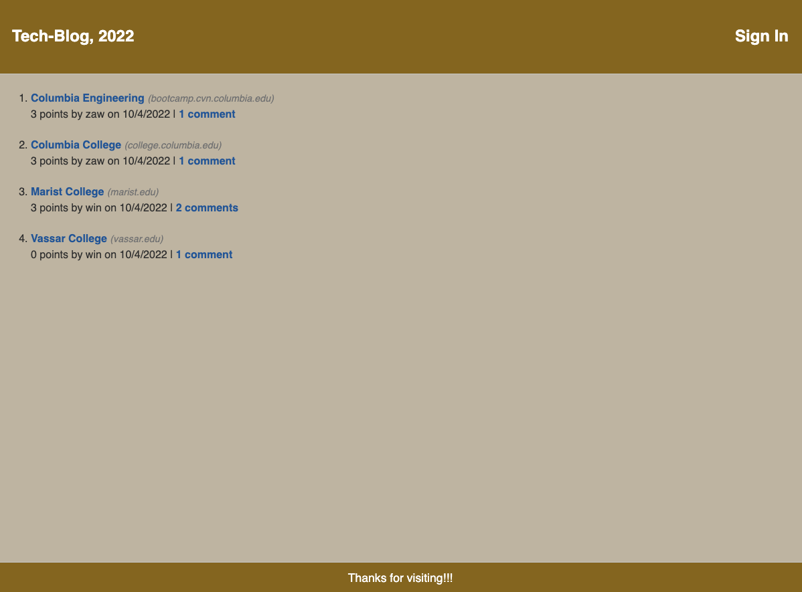
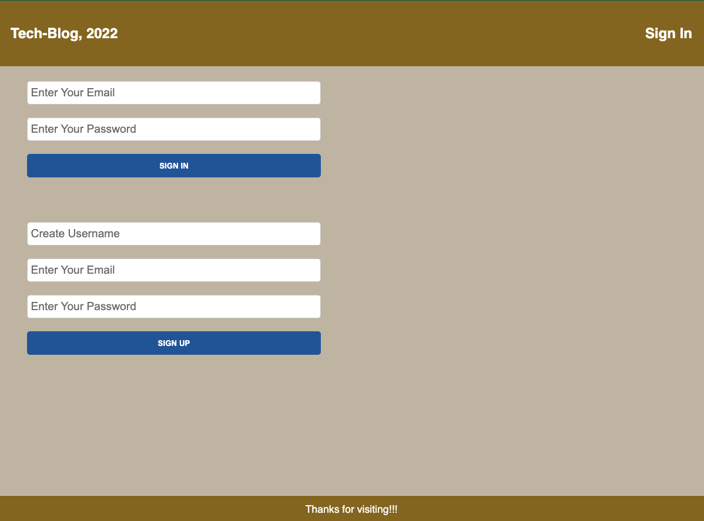
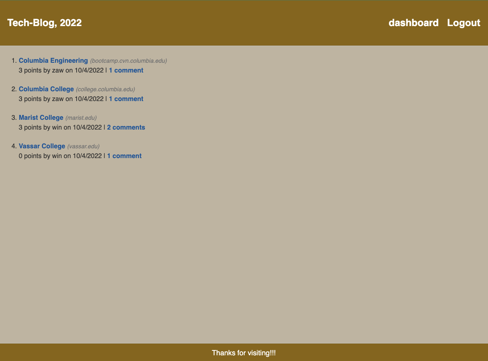
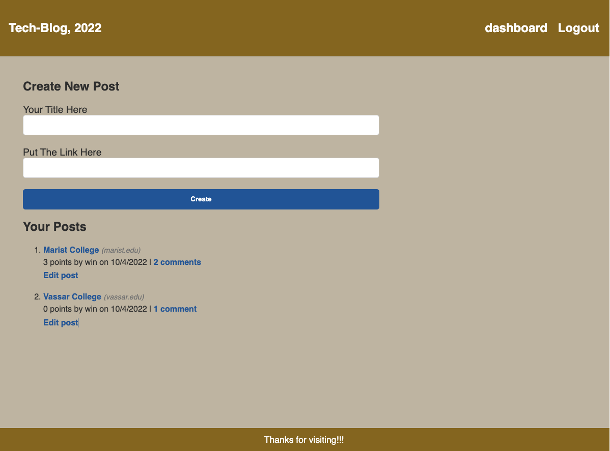

# 14techBlock

## Description

This app is CMS-style blog site and can access the following:

- homepage, which includes existing blog posts; navigation links for the homepage and the dashboard; and the option to log in

- click on the homepage option

- click on any other links in the navigation - either sign up or sign in

- choose to sign up with prompted to create a username and password

- when click on the sign-up button, user credentials are saved and logged into the site

- when revisit the site choose to sign in with prompted to enter my username and password

- when signed in to the site, user can use navigation links for the homepage, the dashboard, and the option to log out

- when click on the homepage option in the navigation, can see homepage with existing blog posts that include the post title and the date created

- when click on an existing blog post presented with the post title, contents, post creator’s username, and date created for that post and have the option to leave a comment

- can enter a comment and click on the submit button while signed in and the post is updated to display the comment, the comment creator’s username, and the date created

- when click on the dashboard option in the navigation, presented with any blog posts I have already created and the option to add a new blog post

- when click on the button to add a new blog post, user can enter both a title and contents for my blog post

- when click on one of my existing posts in the dashboard, user can delete or update post and taken back to an updated dashboard

- when click on the logout option in the navigation, user can sign out of the site

- when user is idle on the site, user can view comments but log in again before user can add, update, or delete comments

## Images

## Links:

github:
git@github.com:Minmaung0307/14techBlock.git

url:
https://minmaung0307.github.io/14techBlock/

https://github.com/Minmaung0307/14techBlock

video:
